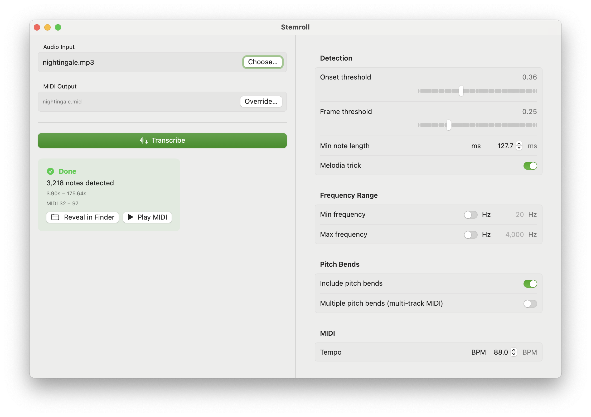

# BasicPitch Swift

Experimental Swift port of Spotify's [basic-pitch](https://github.com/spotify/basic-pitch) — audio-to-MIDI conversion using CoreML. Optional [Demucs MLX](https://github.com/kylehowells/demucs-mlx-swift) integration for stem separation before transcription.

## Requirements

- macOS 14+ / iOS 17+, Xcode 15+, Swift 5.9+
- System frameworks: AVFoundation, CoreML, Accelerate
- Demucs target requires Metal Toolchain (`xcodebuild -downloadComponent MetalToolchain`)

## Build & Run

```
make build     # Release build (both CLIs) + Metal shader library (mlx.metallib)
make install   # Build + copy binaries to repo root
make test      # swift test
make clean     # Remove build artifacts
```

If building manually with `swift build`, the Demucs CLI also needs `./scripts/build_mlx_metallib.sh release` for the MLX Metal shaders.

## CLI Usage

```bash
# Direct audio-to-MIDI
./basic-pitch-cli song.mp3
./basic-pitch-cli song.wav -o output.mid --onset-threshold 0.2 --frame-threshold 0.1

# Demucs stem separation + per-stem transcription
./basic-pitch-demucs-cli song.mp3 --split-stems                          # separate .mid per stem
./basic-pitch-demucs-cli song.mp3 --split-stems --multi-track -o out.mid # single multi-track .mid
./basic-pitch-demucs-cli song.mp3 --split-stems --stems vocals,bass      # specific stems only
./basic-pitch-demucs-cli song.mp3 --split-stems --stem-model htdemucs_ft # fine-tuned model
```

Run either CLI with `--help` for all options.

### Test Script

End-to-end test driver for the full Demucs + BasicPitch pipeline:

```bash
./scripts/test_demucs_pipeline.sh song.mp3 [output-dir]
```

Auto-builds via `make install` if the binary or `mlx.metallib` is missing.

## Demo App (Stemroll)



Stemroll is a native macOS demo app to validate and explore the BasicPitch Swift package. Load audio files, tweak transcription parameters (thresholds, frequency ranges, pitch bends), and see results in real-time. Optional stem separation (drums, bass, vocals, other) for per-stem transcription, tweak params.

## SPM Targets

| Target | Dependencies | Description |
|--------|-------------|-------------|
| `BasicPitch` | none (system frameworks only) | Core audio-to-MIDI library |
| `BasicPitchDemucs` | `BasicPitch`, `demucs-mlx-swift` | Stem separation + per-stem transcription |
| `BasicPitchCLI` | `BasicPitch`, `swift-argument-parser` | CLI wrapper |
| `BasicPitchDemucsCLI` | `BasicPitchDemucs`, `swift-argument-parser` | CLI with stem separation |

```swift
.package(path: "path/to/BasicPitch")
// then depend on "BasicPitch" and/or "BasicPitchDemucs"
```

## Library API

```swift
import BasicPitch

let bp = try BasicPitch()
let result = try bp.predict(audioURL: url)
try result.writeMIDI(to: outputURL)

// Or from raw samples (channel-major [Float], auto-resampled to 22050 Hz mono)
let result = try bp.predict(audioSamples: buffer, channels: 2, sampleRate: 44100)

// Async variants available for both
let result = try await bp.predict(audioURL: url)
```

### Options

```swift
var options = BasicPitchOptions()
options.onsetThreshold = 0.3         // onset sensitivity (0–1), lower = more notes
options.frameThreshold = 0.15        // frame energy threshold (0–1)
options.minimumNoteLengthMS = 127.7  // shortest note in ms
options.minimumFrequency = 80.0      // Hz, nil = no limit
options.maximumFrequency = 2000.0    // Hz, nil = no limit
options.includePitchBends = true     // pitch bends from contour analysis
options.multiplePitchBends = false   // per-note pitch bends (multi-track MIDI)
options.melodiaTrick = true          // polyphonic extraction beyond onsets
options.midiTempo = 120              // BPM
options.progressHandler = { done, total in print("\(done)/\(total)") }
```

### Demucs Stem Separation

```swift
import BasicPitchDemucs

let transcriber = try StemTranscriber()  // or StemTranscriber(demucsModelName: "htdemucs_ft")
let result = try transcriber.transcribe(fileAt: audioURL)
try result.write(to: outputURL)

// Per-stem access
for (stem, r) in result.perStem { print("\(stem): \(r.noteEvents.count) notes") }
```

`StemTranscriptionOptions` controls which stems to process, output mode (`.multiTrackMIDI` or `.separateFiles`), and wraps `BasicPitchOptions`. Stems are assigned GM MIDI channels: drums ch10, bass ch1, vocals ch2, other ch3. Models (`htdemucs`, `htdemucs_ft`) download automatically on first use.

### Custom Model

```swift
let bp = try BasicPitch(modelURL: myModelURL)
// or with MLModelConfiguration for compute unit control
```

## Pipeline

Mirrors the [upstream Python implementation](https://github.com/spotify/basic-pitch):

1. **AudioLoader** — decode + resample to 22050 Hz mono (AVFoundation)
2. **AudioWindower** — overlapping 2s windows (43844 samples, hop 36164)
3. **CoreMLInference** — parallel prediction via `DispatchQueue.concurrentPerform` with multiple `MLModel` copies
4. **OutputStitcher** — overlap removal, concatenation
5. **NoteCreation** — onset peak detection, energy tracking, melodia trick
6. **PitchBend** — Gaussian-windowed contour analysis for sub-semitone bends
7. **MIDIWriter** — raw Standard MIDI File construction

The bundled CoreML model (`nmp.mlpackage`, ICASSP 2022) outputs Notes (172x88), Onsets (172x88), Contours (172x264). Post-processing uses Accelerate (`vDSP`, `cblas`).

**With Demucs:** `StemTranscriber` runs Demucs separation first (via MLX on Metal GPU), then feeds each stem's raw samples through the BasicPitch pipeline independently.

## License

Apache 2.0. Original model and algorithm by Spotify's Audio Intelligence Lab — [paper](https://arxiv.org/abs/2203.09893) (ICASSP 2022).
